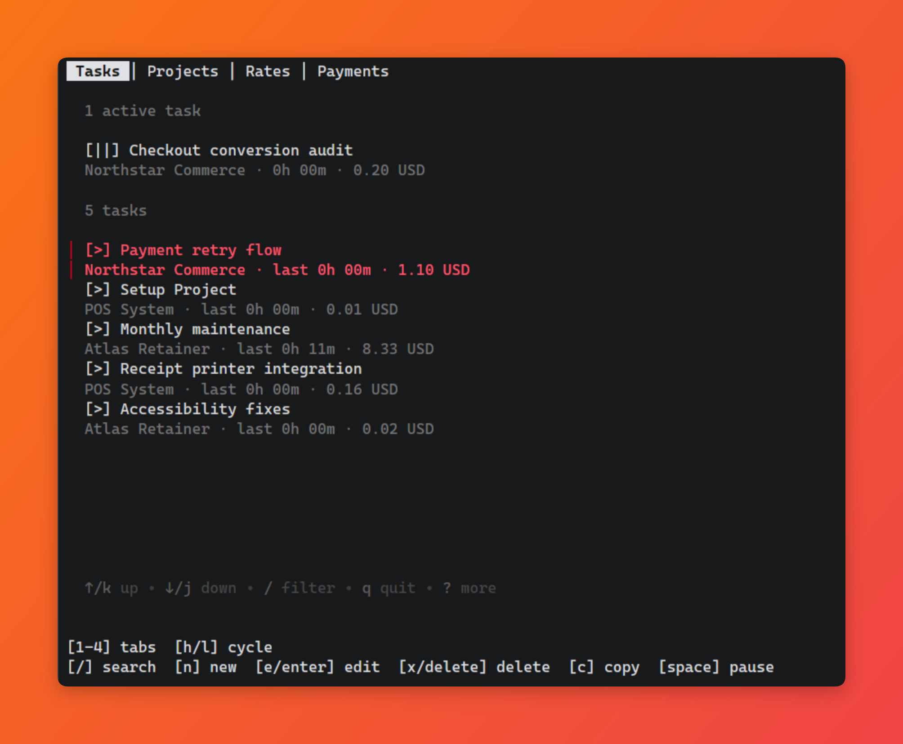
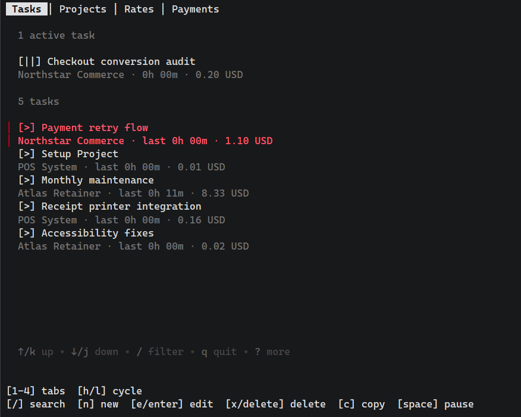
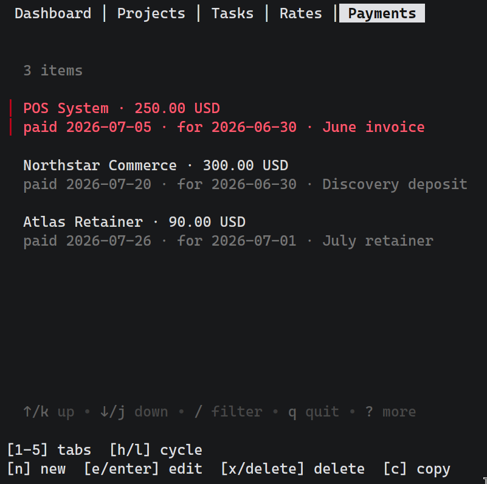
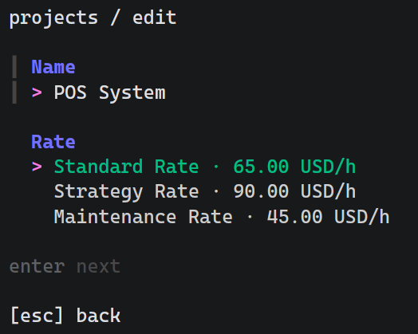
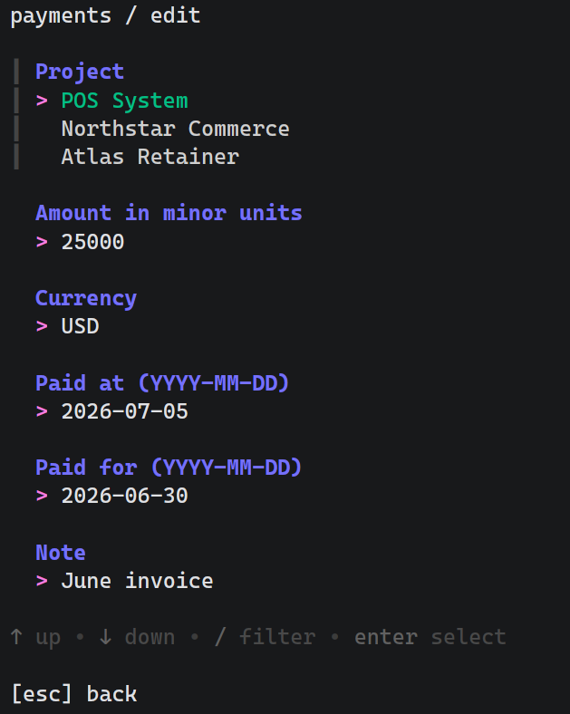

# Chankat

<p align="center">
  
</p>

[](https://github.com/ahme-dev/chankat/actions/workflows/test.yml)
[](https://github.com/ahme-dev/chankat/actions/workflows/build.yml)
[](https://github.com/ahme-dev/chankat/actions/workflows/quality.yml)

Track your work hours across tasks, projects and rates from your terminal.

Chansat comes with:

- TUI controllable by vim motions, and mouse.
- CLI for automation and integration with other apps.

## Install

```sh
curl -fsSL https://raw.githubusercontent.com/ahme-dev/chansat/main/install.sh | sh
```

The installer verifies the release checksum and writes to `~/.local/bin`. Set
`CHANSAT_INSTALL_DIR` or `CHANSAT_VERSION` to override the destination or version.

On windows, please check releases and manually install.

## Releases

Merges to `main` are released from [Conventional Commits](https://www.conventionalcommits.org/):

- `fix:` creates a patch release.
- `feat:` creates a minor release.
- `BREAKING CHANGE:` creates a major release.
- Other commit types do not create a release.

Release archives are built for Linux, macOS and Windows.

## Screenshots

| Tasks | Payments |
| --- | --- |
|  |  |
| Project editor | Payment editor |
|  |  |
